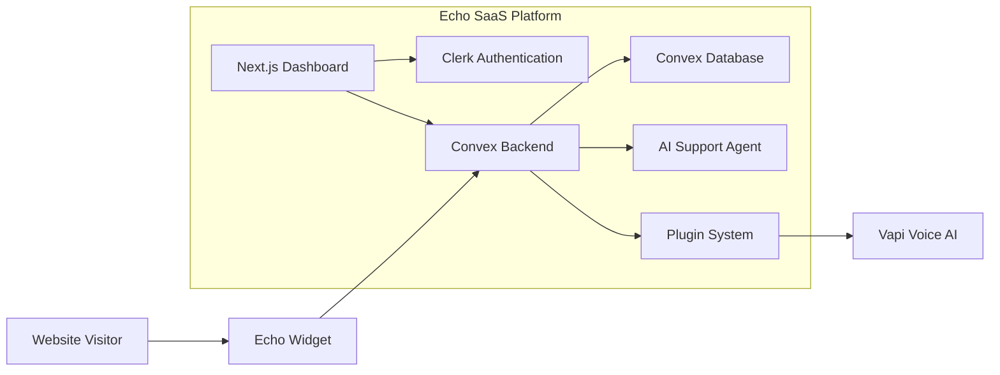

<div align="center">

# Echo

### B2B SaaS Customer Communication Platform

A full-stack, multi-tenant SaaS platform that enables businesses to integrate
real-time customer communication, AI-powered support, and voice AI
directly into their websites.

Built with **Next.js, TypeScript, Convex, Clerk, Vapi, Turborepo, and pnpm**
using a scalable monorepo architecture.

[](#)
[](#)
[](#)
[](#)
[](#)
[](#)

</div>

---

## About Echo

**Echo** is a B2B SaaS customer communication platform designed to help
businesses communicate with website visitors through an embeddable support
experience.

The platform combines a SaaS management dashboard, an embeddable
customer-facing widget, real-time conversations, AI-assisted support,
organization-based data isolation, and voice AI integrations.

Echo is designed as a **multi-tenant system**, where each organization manages
its own conversations, integrations, widget configuration, and customer
sessions.

The project is structured as a scalable **Turborepo monorepo**, allowing the
web application, widget, backend, and shared packages to evolve independently
while reusing common infrastructure.

---

## Key Features

### Multi-Tenant SaaS Architecture

Echo isolates application data by organization.

Organization-aware backend operations ensure that users can only access
conversations and resources belonging to their organization.

This architecture allows multiple businesses to use the same platform while
maintaining separation between their data and integrations.

### Customer Communication Widget

Echo includes a dedicated widget application designed to be embedded into
customer websites.

The widget provides the customer-facing communication layer while the main
application provides the management interface for businesses.

### Real-Time Conversation Management

The platform manages conversations between website visitors and businesses.

Conversations support multiple states:

- `unresolved`
- `escalated`
- `resolved`

The dashboard can retrieve conversations by organization and filter them by
status.

### AI-Powered Support

Echo integrates an AI support agent into the conversation workflow.

New conversations can create dedicated AI agent threads, allowing messages to
be associated with individual customer conversations.

### Voice AI Integration

Echo includes integration with **Vapi** for voice AI functionality.

Organizations can connect their own Vapi configuration and retrieve available:

- AI assistants
- Phone numbers

Integration credentials are handled on the backend rather than exposed directly
to the client.

### Contact Sessions

Website visitors are represented using contact sessions.

Sessions can contain information such as:

- Name
- Email
- Language
- Platform
- Browser metadata
- Screen resolution
- Viewport size
- Timezone
- Referrer
- Current URL

Sessions also include expiration handling.

### Configurable Widget

Organizations can configure their customer-facing widget, including:

- Greeting message
- Default suggestions
- Vapi assistant
- Vapi phone number

### Integration / Plugin Architecture

Echo includes an organization-based plugin system.

Integrations are associated with individual organizations, allowing external
services to be configured independently for each tenant.

---

## Architecture


```mermaid
flowchart LR

    Visitor["Website Visitor"]
    Widget["Echo Widget"]

    subgraph Echo["Echo SaaS Platform"]
        Dashboard["Next.js Dashboard"]
        Auth["Clerk Authentication"]
        Backend["Convex Backend"]
        Agent["AI Support Agent"]
        Database["Convex Database"]
        Plugins["Plugin System"]
    end

    Vapi["Vapi Voice AI"]

    Visitor --> Widget

    Widget --> Backend
    Dashboard --> Auth
    Dashboard --> Backend

    Backend --> Database
    Backend --> Agent
    Backend --> Plugins

    Plugins --> Vapi
```

---

## Multi-Tenant Data Model

Each organization operates inside its own logical workspace.

```text
Organization
│
├── Widget Settings
│   ├── Greeting Message
│   ├── Default Suggestions
│   └── Vapi Configuration
│
├── Plugins
│   └── Vapi
│
├── Contact Sessions
│   │
│   └── Conversations
│       ├── AI Thread
│       ├── Messages
│       └── Status
│
└── Integrations
```

Organization-aware indexes and authorization checks are used throughout the
backend to efficiently retrieve tenant-specific data.

---

## Tech Stack

### Frontend

- Next.js
- React
- TypeScript
- Tailwind CSS
- React Hook Form
- Zod
- Jotai

### Backend

- Convex
- Convex Database
- Convex Agent
- TypeScript

### Authentication

- Clerk
- Organization-based authentication

### AI & Communication

- AI Support Agent
- Vapi
- Real-time conversation workflows

### Architecture & Tooling

- Turborepo
- pnpm Workspaces
- Shared UI packages
- Shared TypeScript configuration
- Shared ESLint configuration
- Sentry

---

## Engineering Highlights

Echo demonstrates several architectural patterns commonly used in modern SaaS
applications.

### Tenant Isolation

Backend queries verify the authenticated user's organization before returning
organization-specific resources.

This prevents users from accessing conversations belonging to another tenant.

### Indexed Data Access

The Convex schema defines indexes for frequently queried relationships,
including:

```text
organizationId
contactSessionId
threadId
conversation status + organizationId
organizationId + plugin service
```

These indexes support efficient organization-scoped queries.

### Conversation Lifecycle

Customer conversations follow a defined lifecycle:

```text
Visitor starts conversation
        │
        ▼
Contact Session
        │
        ▼
Conversation Created
        │
        ▼
AI Agent Thread
        │
        ▼
Messages
        │
        ├── unresolved
        │
        ├── escalated
        │
        └── resolved
```

### Secure Integration Credentials

Third-party integration credentials are resolved on the backend.

The client interacts with application actions rather than directly handling
private integration credentials.

### Paginated Conversation Queries

Conversation retrieval uses pagination and organization-aware indexes to support
scalable inbox-style interfaces.

---

## Monorepo Structure

```text
echo/
│
├── apps/
│   │
│   ├── web/
│   │   └── Main SaaS management dashboard
│   │
│   └── widget/
│       └── Embeddable customer communication widget
│
├── packages/
│   │
│   ├── backend/
│   │   └── Convex backend, schema, AI agents and integrations
│   │
│   ├── ui/
│   │   └── Shared UI component library
│   │
│   ├── typescript-config/
│   │   └── Shared TypeScript configuration
│   │
│   └── eslint-config/
│       └── Shared ESLint configuration
│
├── pnpm-workspace.yaml
├── turbo.json
└── package.json
```

---

## Applications

### `apps/web`

The main B2B SaaS dashboard.

Responsible for organization-level platform management, conversations,
integrations, and widget configuration.

### `apps/widget`

The customer-facing communication application designed to be embedded into
business websites.

### `packages/backend`

Shared Convex backend containing:

- Database schema
- Queries and mutations
- Contact sessions
- Conversations
- Messages
- AI agents
- Widget settings
- Plugin management
- Vapi integration

### `packages/ui`

Reusable UI components shared across applications.

---

## Getting Started

### Prerequisites

Make sure the following tools are installed:

```text
Node.js >= 20
pnpm >= 9
```

### Clone the Repository

```bash
git clone https://github.com/ali-salhab/echo.git
cd echo
```

### Install Dependencies

```bash
pnpm install
```

### Start Development

```bash
pnpm dev
```

Turborepo will start the workspace applications in development mode.

### Build

```bash
pnpm build
```

### Type Checking

```bash
pnpm typecheck
```

### Linting

```bash
pnpm lint
```

---

## Project Goals

Echo is being developed as a modern B2B SaaS architecture focused on:

- scalable multi-tenant application design
- AI-assisted customer communication
- embeddable SaaS widgets
- organization-level integrations
- real-time customer support workflows
- reusable monorepo architecture
- secure third-party service integration

---

## Author

**Ali Salhab**

Full-Stack Software Developer

React · Next.js · TypeScript · Node.js · React Native · AI Integrations

Portfolio: **alisalhab.com**

GitHub: **github.com/ali-salhab**

</div>
